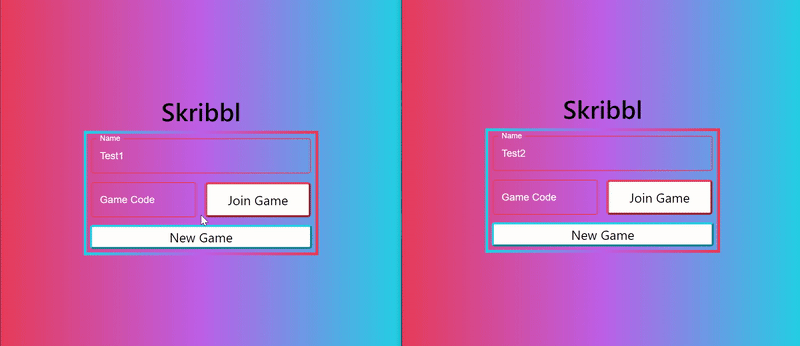
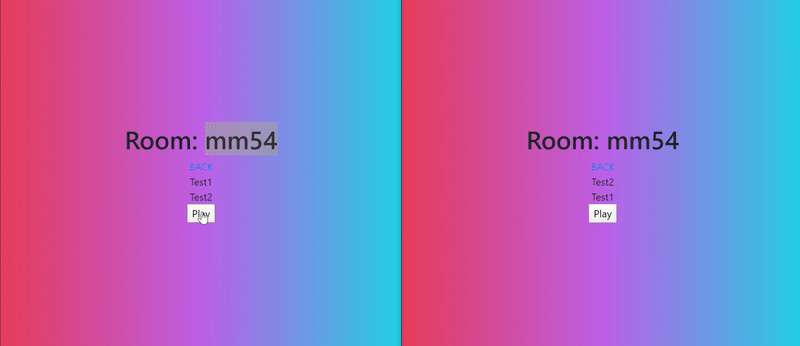
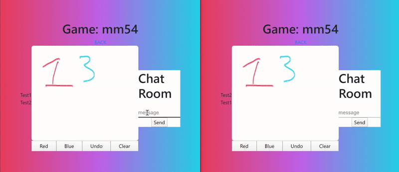

# Pictionary Live
This is an online multiplayer version of pictionary.

Currently live at: [Pictionary Live](https://hubert322.github.io/pictionary)

This project is created using React, Flask, MongoDB, and Socket.IO

## Demo
Allow players to join the same room

Synchronized drawing with various features

Chatroom feature

